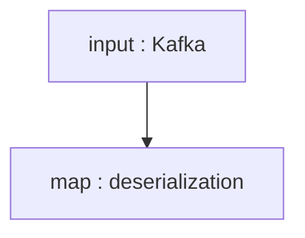

# Bytewax Take Home Assignment

## Question 1
> For the open source package, we have the concept of API Docs which reference different classes and methods available, and the concept of long format docs which include more in-depth discussion about technical concepts. Using the code snippet below, write some long format documentation that explains the concept of a dataflow, bytewax built-in inputs and the map operator.


### Simple Bytewax Stream Processing Example 

In this document, I will walk through how to use Bytewax to build a simple streaming application implemented in Python. Bytewax is an open-source Python framework for stream processing. It is a distributed processing engine that can be used to process large amounts of data in real time. Bytewax is designed to be easy to use and can be used to build a variety of stream processing applications, including fraud detection, network monitoring, and bot detection.

The application that we will be building will read from a streaming platform. In this case, it will be `Apache Kafka`. Then we will pass the data stream into a `map` function to deserialize the data.

**Flow**



Above is a diagram of the flow of data in the application we will build. Notice it has an input node in the flow but does not have an output. This is by design. By the end of this tutorial, you'll be able to provide your output to complete the flow. Bytewax will not work if the flow does not have an output. Let's get started.


### Setting Up the Environment

Start by creating a virtual environment and installing Bytewax using `pip` and activating it.

```bash
python -m venv .venv
pip install bytewax
source .venv/bin/activate
```
Next, create a file called example.py and add the following import statements which include the Bytewax module.

```python
import json

from bytewax.connectors.kafka import KafkaInput
from bytewax.dataflow import Dataflow
```

### Dataflow in Bytewax

Next, construct a Bytewax Dataflow object.

```python
flow = Dataflow()
```

The Dataflow object is a fundamental concept in the Bytewax open-source package that represents the flow of data and operations within a machine learning pipeline or workflow. It provides a structured and flexible way to define the sequence of operations and transformations applied to the input data.

### Bytewax Built-in Inputs

Now that we have a Dataflow object to build our flow, we start it off by creating an input source of data. In the below snippet, we call a function within the `flow` object to add its `input`.

```python
flow.input("inp", KafkaInput(["localhost:9092"], ["input_topic"]))
```

Bytewax provides a set of built-in inputs that are designed to simplify the handling and processing of data within a Dataflow. These inputs serve as sources of data for the pipeline and can be connected to different operations or nodes within the dataflow. 

In the case of the above snippet, we are using a `KafkaInput`. Kafka is a very popular streaming platform that enables the publishing and subscribing of streaming data. 

There are two parameters in the `KafkaInput` constructor:

- An array of Kafka brokers hosts/ports. Kafka is a distributed system but in our case, we are connecting to a single broker Kafka cluster running locally.
- An array of Kafka topic names. Kafka subscribers can consume multiple topics in Kafka. In Kafka, topics hold streaming data.


### Map Operator
The map operator is a key component in the Bytewax dataflow framework that allows for the transformation and manipulation of data within the pipeline. It applies a user-defined function or operation to each element of the input data, producing a modified output.

In the context of Bytewax, the map operator can be used to perform various operations on the data, such as feature engineering, data cleaning, or applying custom transformations. It allows users to define their functions or operations that are applied to individual elements or records of the input data.

Below is an example of a map function that deserializes data coming from Kafka. 

```python
def deserialize(key_bytes__payload_bytes):
    key_bytes, payload_bytes = key_bytes__payload_bytes
    key = json.loads(key_bytes) if key_bytes else None
    payload = json.loads(payload_bytes) if payload_bytes else None
    return key, payload

flow.map(deserialize)
```


### Summary
Below is the complete source code for the stream processor. If you are familiar with PySpark or PyFlink, you'll notice a very close similarity to those frameworks.

```python
import json

from bytewax.connectors.kafka import KafkaInput
from bytewax.dataflow import Dataflow

flow = Dataflow()
flow.input("inp", KafkaInput(["localhost:9092"], ["input_topic"]))

def deserialize(key_bytes__payload_bytes):
    key_bytes, payload_bytes = key_bytes__payload_bytes
    key = json.loads(key_bytes) if key_bytes else None
    payload = json.loads(payload_bytes) if payload_bytes else None
    return key, payload

flow.map(deserialize)
```

# Question 2
> For the final part of the take-home assignment, we ask that you modify an example in the bytewax repository to use a different data source and explain in 2-3 paragraphs what you did and what value the example now showcases that is unique to building something with Bytewax. The example in the repository uses the built-in Kafka input and it uses a window operator to calculate a running average. It uses event time and is based on mock data generated and sent to Kafka. In order to use a new data source, you will have to swap out the Kafka input for something custom. Some examples of custom inputs can be found here, here, and here.


In this use case, I use a custom Bytewax input that subscribes to server-side page change events from Wikipedia. I specifically search for bots that are changing pages and identify ones that have a rate greater than 10 pages per second (10pg/sec) in a 5-second window. I filter out page changes that are changing at a rate of 1 page/sec. 

Bots are used heavily for many arduous tasks done on the internet but some could become malicious causing DDoS (distributed denial of service) if they update pages at a high throughput. By utilizing Bytewax, I'm able to capture these bots very easily and display them on the console. Since Bytewax allows me to write my streaming pipeline in Python, I'm able to include Python ML models for more sophisticated detection

```python
#!/usr/bin/env python
# coding: utf-8

import json
from datetime import datetime, timedelta, timezone

from bytewax.connectors.kafka import KafkaInput
from bytewax.dataflow import Dataflow
from bytewax.connectors.stdio import StdOutput
from bytewax.window import EventClockConfig, TumblingWindow
from bytewax.inputs import PartitionedInput, StatefulSource

import sseclient
import urllib3


class WikiSource(StatefulSource):
    def __init__(self):
        pool = urllib3.PoolManager()
        resp = pool.request(
            "GET",
            "https://stream.wikimedia.org/v2/stream/recentchange/",
            preload_content=False,
            headers={"Accept": "text/event-stream"},
        )
        self.client = sseclient.SSEClient(resp)
        self.events = self.client.events()

    def next(self):
        return next(self.events).data

    def snapshot(self):
        return None

    def close(self):
        self.client.close()


class WikiStreamInput(PartitionedInput):
    def list_parts(self):
        return {"single-part"}

    def build_part(self, for_key, resume_state):
        assert for_key == "single-part"
        assert resume_state is None
        return WikiSource()
    

# Define the dataflow object and WikiStream SSE input.
flow = Dataflow()
flow.input("inp", WikiStreamInput())
flow.map(json.loads)

def extract_user(event):
    return event['user'], event

flow.map(extract_user)

# This is the accumulator function, and outputs a list of 2-tuples,
# containing the event's "title" and it's "time" (used later to print info)
def acc_values(acc, event):
    acc.append((event["title"], event["timestamp"]))
    return acc


# This function instructs the event clock on how to retrieve the
# event's datetime from the input.
# Note that the datetime MUST be UTC. If the datetime is using a different
# representation, we would have to convert it here.
def get_event_time(event):
    return datetime.fromtimestamp(event["timestamp"], tz=timezone.utc)


# Configure the `fold_window` operator to use the event time.
cc = EventClockConfig(get_event_time, wait_for_system_duration=timedelta(seconds=10))

# And a 5 seconds tumbling window
align_to = datetime(2023, 1, 1, tzinfo=timezone.utc)
wc = TumblingWindow(align_to=align_to, length=timedelta(seconds=5))

flow.fold_window("running_count", cc, wc, list, acc_values)

def is_malicious(event):
    '''
    This checks to see if the pages updated per second exceeds 10pages/sec.
    If it does, the bot is considered malicious and returns a tuple of the
    event and is_malicious.
    '''
    key, data = event
    dates = [datetime.fromtimestamp(x[1]) for x in data]
    delta = max(dates) - min(dates)
    count = len(data)
    sec = 1 if delta.total_seconds()==0 else delta.total_seconds()
    is_malicious = True if count/sec > 10 else False
    return event, is_malicious

# Calculate the average of the values for each window, and
# format the data to a string
def format(event__mal):
    event, mal = event__mal
    key, data = event
    # values = [x[0] for x in data]
    dates = [datetime.fromtimestamp(x[1]) for x in data]
    delta = max(dates) - min(dates)
    count = len(data)
    return (
        f"{key} updated {count} pages in {delta} seconds {'and is malicious!!!!' if mal else ''}"
    )

def filter_events(event):
    '''
    Filter for only change events that are greater than 1
    '''
    return len(event[1]) > 1

flow.filter(filter_events)
flow.map(is_malicious)
flow.map(format)
flow.output("out", StdOutput())


```